** /!\ Work in progress, this README needs to be completed. **

# smart-meter
To demonstrate a Smart Meter Big Data Application.

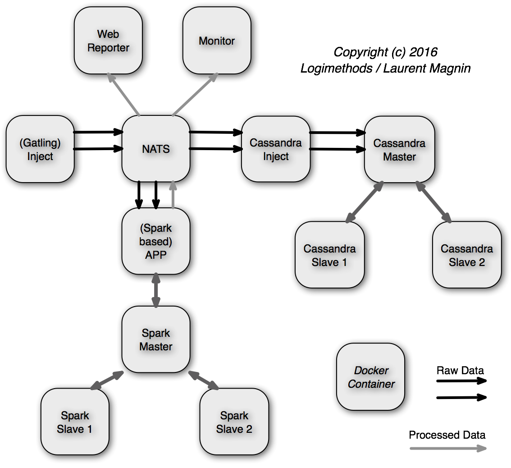

## Docker Compose

* First, install [yamlreader](https://github.com/ImmobilienScout24/yamlreader).
* Then, create your `docker-compose-merge.yml` file:
** When Docker Secrets are provided
```shell
yamlreader compose/docker-compose-main.yml compose/docker-compose-secrets.yml > docker-compose-merge.yml
```
** When Docker Secrets are NOT provided
```shell
yamlreader compose/docker-compose-main.yml compose/docker-compose-no-secrets.yml > docker-compose-merge.yml
```

```
./docker-[local | remote]-[single | cluster]-up.sh
.../...
./docker-[local | remote]-down.sh
```

## Python CLI

### Local

See [start-services.py](start-services.py)
```
> python3 -i ./start-services.py
>>> run_inject()
>>> run_app_batch()
...
>>> stop_all()
...
>>> exit()
```

Setup the Grafana Data Sources (see bellow) + Import [gatling + max voltage.json](dockerfile-metrics/gatling%20%2B%20max%20voltage.json)

[http://localhost/dashboard/db/gatling-max-voltage](http://localhost/dashboard/db/gatling-max-voltage)

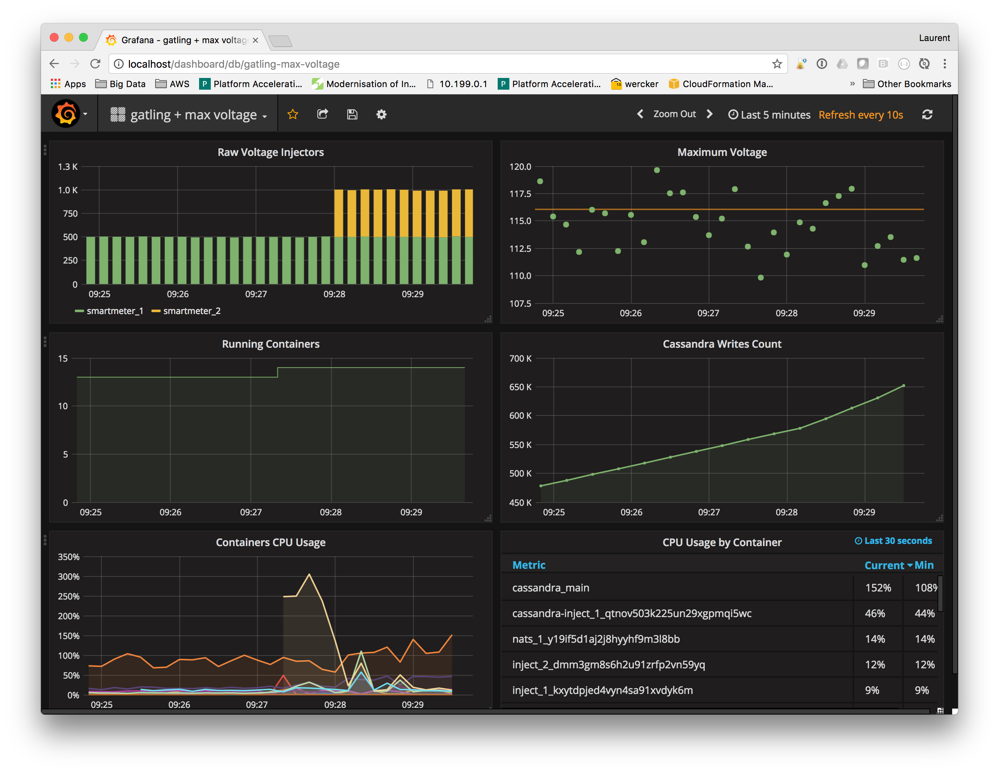

In parallel, you can play with the number of injectors:
```
> docker service scale inject=2
> docker service scale inject=1
```

### Local (DEV mode)

```
> ./build_DEV.sh
> ./stop.sh
> python3 -i start-services.py "local" "single" "-DEV"
Images will be postfixed by -DEV
>>> run_inject()
```

### Remote (on Docker Swarm)

```
> ssh -NL localhost:2374:/var/run/docker.sock docker@xxxxx.amazonaws.com &
> python3 -i ./start-services.py "remote" "cluster"
> Remote Docker Client
>>> run_inject_cluster()
...
>>> stop_all()
...
>>> exit()
```

Setup the Grafana Data Sources (see bellow) + Import [gatling + max voltage - swarm.json](dockerfile-metrics/gatling%20%2B%20max%20voltage%20-%20swarm.json).


## Architectures
The *Injection* demo architecture:
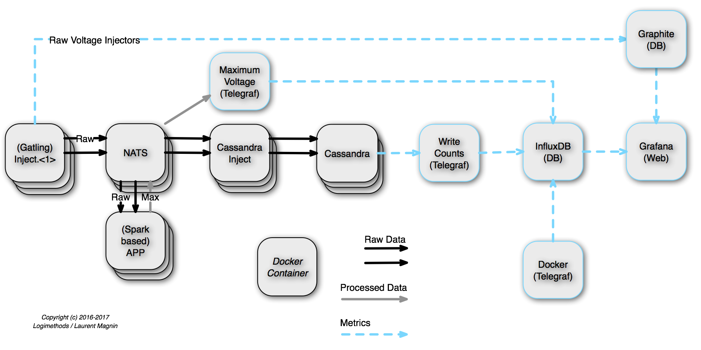

The *Batch* demo architecture:
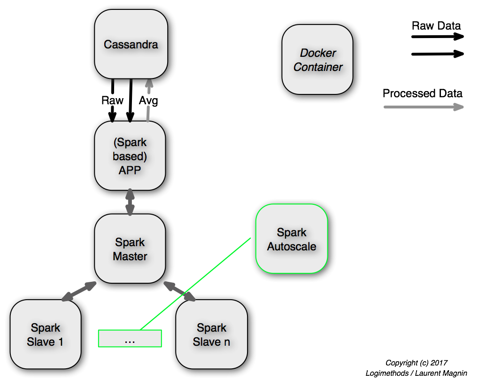

## Grafana Setup

From [Grafana](http://localhost:80), setup the Graphite, InfluxDB & Prometheus Data Sources (see bellow).

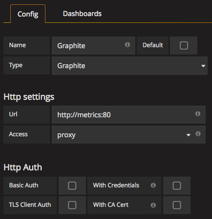
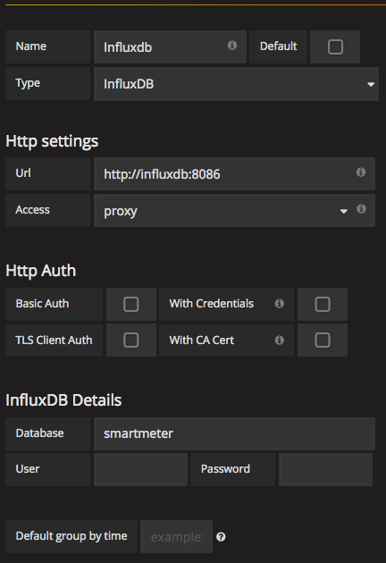
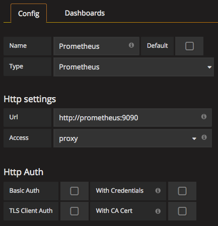

## CQLSH (Cassandra CLI)
To access to the RAW Voltage Data:
```
> ./cqlsh.sh
Connected to Smartmeter Cluster at 127.0.0.1:9042.
[cqlsh 5.0.1 | Cassandra 3.5 | CQL spec 3.4.0 | Native protocol v4]
Use HELP for help.
cqlsh> select * from smartmeter.raw_data limit 2;

line | transformer | usagepoint | year | month | day | hour | minute | day_of_week | demand | val10 | val11 | val12 | val3 | val4 | val5 | val6 | val7 | val8 | val9 | voltage
------+-------------+------------+------+-------+-----+------+--------+-------------+--------+-------+-------+-------+------+------+------+------+------+------+------+-----------
  11 |           2 |          5 | 2019 |     3 |  17 |   12 |     13 |           0 |    100 |    10 |    11 |    12 |    3 |    4 |    5 |    6 |    7 |    8 |    9 | 114.76842
  11 |           2 |          5 | 2019 |     3 |  17 |   11 |     58 |           0 |    100 |    10 |    11 |    12 |    3 |    4 |    5 |    6 |    7 |    8 |    9 | 114.10834
```

## Training & Predictions

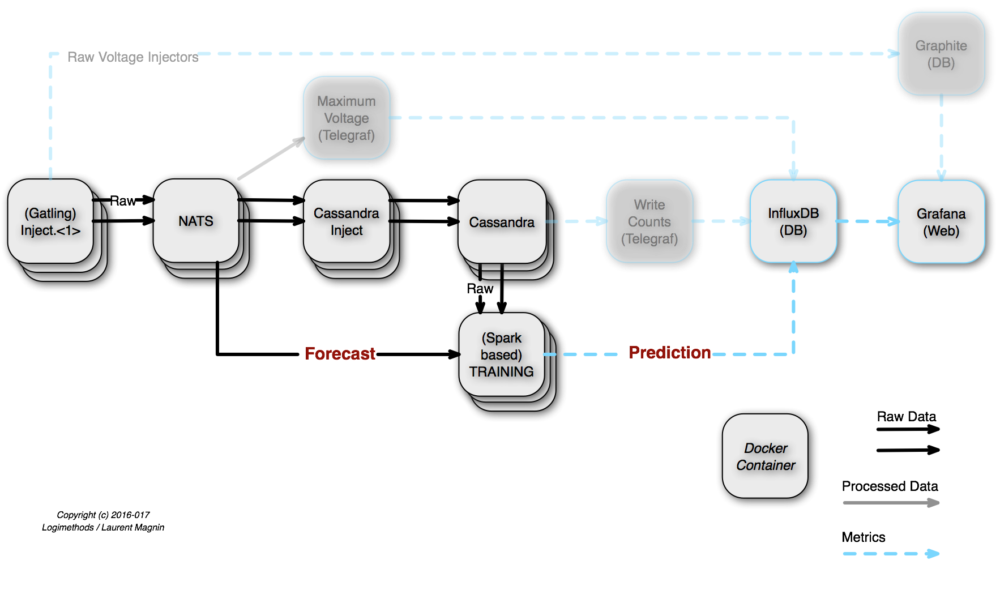

See [Multilayer perceptron classifier](http://spark.apache.org/docs/latest/ml-classification-regression.html#multilayer-perceptron-classifier) and [SparkPredictionProcessor.scala](dockerfile-app-streaming/src/main/scala/com/logimethods/nats/connector/spark/app/SparkPredictionProcessor.scala)
```
+-----+----------+----+--------------------+--------------------+---------+-----------+--------------------+----------+
|label|   voltage|hour|             hourSin|             hourCos|dayOfWeek|temperature|            features|prediction|
+-----+----------+----+--------------------+--------------------+---------+-----------+--------------------+----------+
|    0| 115.36195|  13| -12.940958284226115| -48.296289698960514|        0| -1.1098776|[-12.940958284226...|       0.0|
|    0|115.378006|  14| -24.999994594456457|   -43.3012733101135|        0|  16.545746|[-24.999994594456...|       0.0|
|    0|  116.9641|   3|   35.35533905932737|   35.35533905932738|        0|   4.004334|[35.3553390593273...|       0.0|
|    1| 118.92017|  23|  -12.94095828422611|  48.296289698960514|       50|  21.167358|[-12.940958284226...|       0.0|
|    1| 119.15324|  12|6.123233995736766...|               -50.0|       50| -12.110409|[6.12323399573676...|       1.0|
|    0|  115.1506|  14| -24.999994594456457|   -43.3012733101135|        0|  10.854811|[-24.999994594456...|       0.0|
|    0|115.264404|  14| -24.999994594456457|   -43.3012733101135|        0|  17.071587|[-24.999994594456...|       0.0|
.../...
|    1| 117.36004|   9|   35.35533905932738|  -35.35533905932737|       50|  -12.67373|[35.3553390593273...|       1.0|
|    1| 117.69681|  19|  -48.29628969896052|   12.94095828422609|       50|  17.909231|[-48.296289698960...|       0.0|
|    1|117.809166|  21| -35.355339059327385|   35.35533905932737|        0|   7.070238|[-35.355339059327...|       1.0|
|    0| 115.50017|  16|  -43.30127331011349|  -24.99999459445649|        0|  18.125008|[-43.301273310113...|       0.0|
+-----+----------+----+--------------------+--------------------+---------+-----------+--------------------+----------+
only showing top 20 rows

Test set accuracy = 0.9642857142857143
```

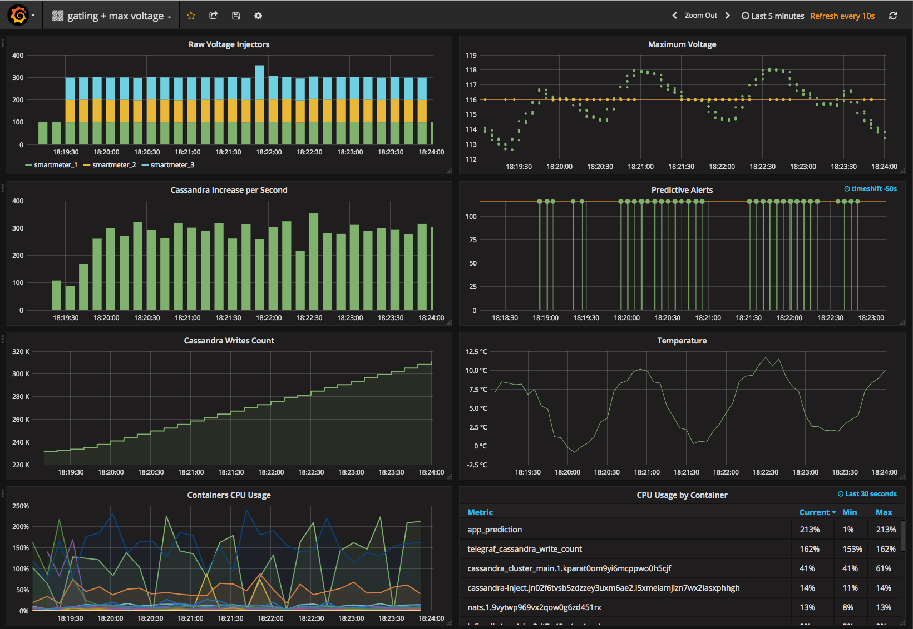

The generated ML Models are stored in HDFS (on port `50070`): [Browsing HDFS](http://localhost:50070/explorer.html#/smartmeter/voltage_prediction.model/)

## Additional Metrics

### NATS Metrics
Setup the Grafana Data Sources + Import [NATS Servers.json](dockerfile-metrics/NATS%20Servers.json).
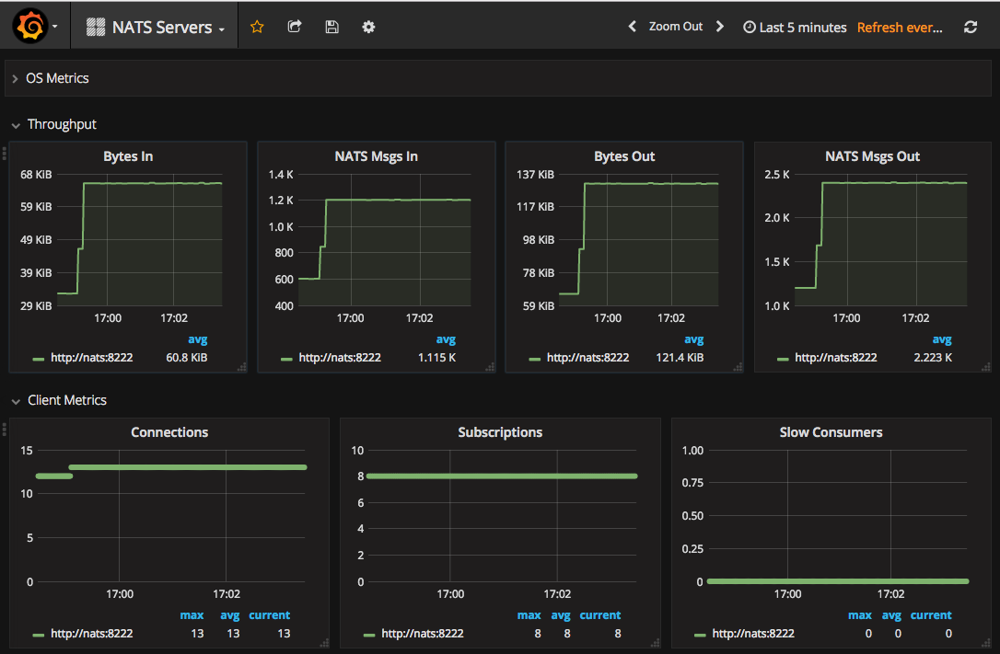

## Excel

### Install the ODBC Driver

* Get the Driver from http://www.simba.com/drivers/cassandra-odbc-jdbc/
* Follow the Installation Instructions (on MacOS, don't forget first to install [iODBC](http://www.iodbc.org/))
* Save the Licence file you received by Mail (`SimbaApacheCassandraODBCDriver.lic`) into the right location

### Create a SDN File

* Define a SDN file, such as [excel/cassandra.dsn](excel/cassandra.dsn)
* You could load & test it directly through the iODBC Administrator App:
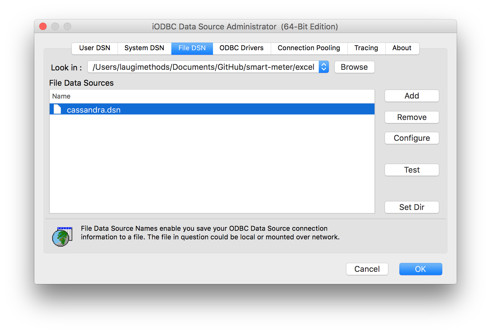

### Connect to the External Data from Excel using the `iODBC Data Source Chooser` (File DSN)

* You might use the SQL syntax, such as `select * from smartmeter.raw_data limit 10;`
* Et Voilà!

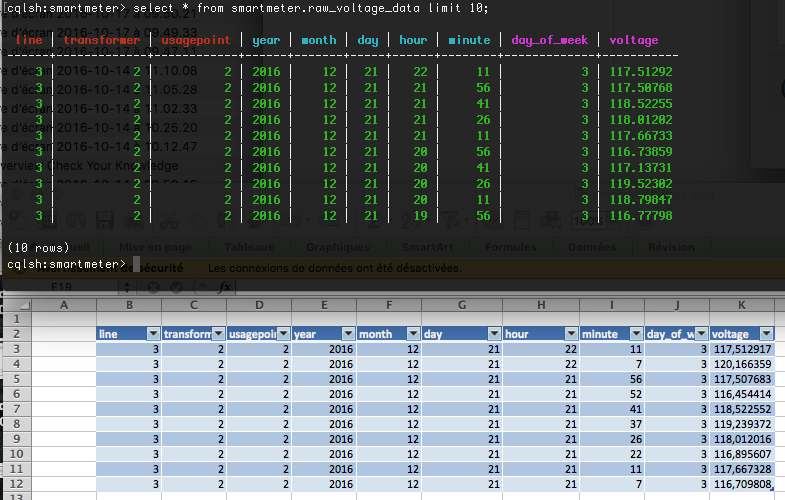
